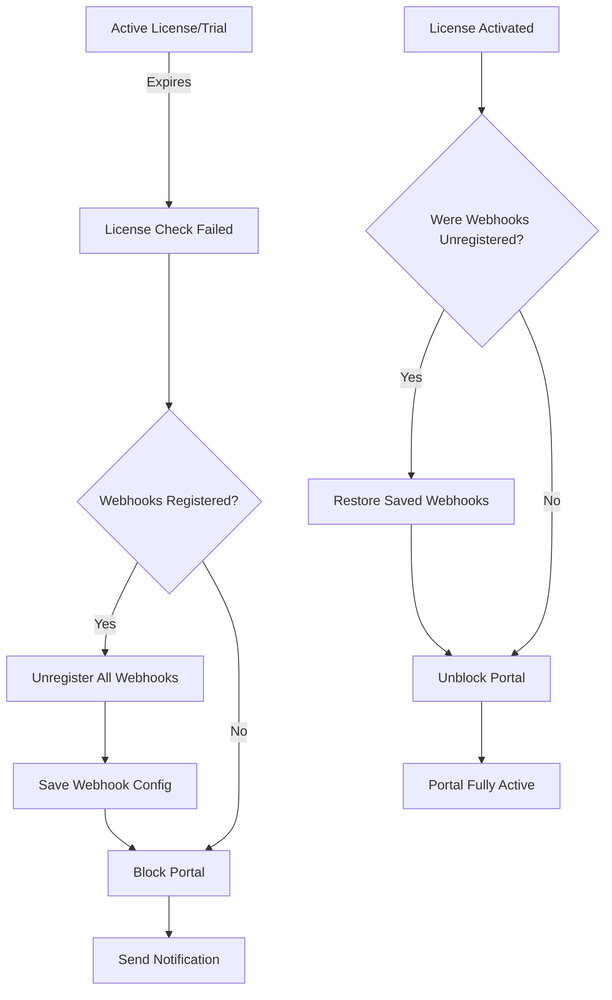

<!-- DEVELOPMENT_GUIDE.md -->
# Development Guide

## Architecture Overview

```
REQUEST → public/index.php → bootstrap.php → Database::init() → Handler → Response
         ↓                                   ↓
    webhook.php                         Auto-create tables
         ↓                                   ↓
    routes.php → Handler::process()    TokenManager
```

---

## Creating New Application

### 1. Setup Environment
```bash
# Clone template
cp -r bitrix24-app-template/ my-app/
cd my-app/

# Configure
cp .env.example .env
# Edit .env with your credentials

# Directory permissions
chmod 755 storage/
chmod 755 storage/logs/
```

### 2. Register in Bitrix24
```
1. Go to: Applications → Developer resources → Add application
2. Type: Online application
3. Handler path: https://your-domain.com/install/
4. Save CLIENT_ID and CLIENT_SECRET to .env
```

### 3. Database Auto-Setup
```php
// Tables created automatically on first request via bootstrap.php
// No manual SQL needed
// Check creation: /api/health.php
```

---

## Request Flow

### Installation Flow
```
Bitrix24 → /install/index.php
         → install.js → BX24.init()
         → event.bind (ONAPPINSTALL, ONAPPUNINSTALL)
         → /api/webhook.php (ONAPPINSTALL)
         → InstallHandler::handle()
         → Database::savePortal() [member_id = UNIQUE]
         → Set trial: 14 days
         → BX24.installFinish()
```

### Regular Request Flow
```
Bitrix24 → /public/index.php
         → bootstrap.php (init DB, logger)
         → Check portal exists
         → Check license status
         → Load index.html
         → BX24.init() → API calls
```

### Event Processing Flow
```
Bitrix24 Event → /api/webhook.php
              → Validate auth[domain, member_id, application_token]
              → routes.php → Find handler class
              → Handler::process()
                  → validateAuth()
                  → checkLicense() [skip for Install/Uninstall]
                  → handle() [your logic]
              → Response::json()
```

---

## Creating Event Handler

### Step 1: Create Handler Class
```php
// backend/handlers/events/MyCustomHandler.php
namespace Handlers\Events;

use Handlers\BaseHandler;

class MyCustomHandler extends BaseHandler
{
    public function handle(): array
    {
        // Get event data
        $data = $this->getEventData();
        $entityId = $this->getEventField('ID');
        
        // Your business logic
        $result = $this->processEntity($entityId);
        
        // Return response
        return [
            'success' => true,
            'data' => $result
        ];
    }
    
    private function processEntity($id): array
    {
        // Call Bitrix24 API
        $entity = $this->callBitrixMethod('crm.deal.get', ['id' => $id]);
        
        // Save to database
        $this->saveSetting('last_processed', $id);
        
        // Log action
        $this->logger->info('Entity processed', ['id' => $id]);
        
        return $entity['result'] ?? [];
    }
}
```

### Step 2: Register in Routes
```php
// backend/config/routes.php
return [
    'oncustomEvent' => \Handlers\Events\MyCustomHandler::class,
    // ... other handlers
];
```

### Step 3: Register in Bitrix24
```php
// Automatic during installation via InstallHandler
// Or manually:
$this->callBitrixMethod('event.bind', [
    'event' => 'ONCUSTOMEVENT',
    'handler' => 'https://your-domain.com/api/webhook.php'
]);
```

---

## Creating API Endpoint

### Add to REST API
```php
// public/api/rest.php - Add to switch statement

case 'custom/action':
    handleCustomAction($portal, $requestData, $db);
    break;

// Add handler function
function handleCustomAction($portal, $data, $db): void
{
    // Validate input
    if (empty($data['param'])) {
        Response::error('Parameter required', 400);
    }
    
    // Process
    $result = processCustomLogic($data['param']);
    
    // Return
    Response::success(['result' => $result]);
}
```

### Call from Frontend
```javascript
fetch('/api/rest.php/custom/action', {
    method: 'POST',
    headers: {
        'Content-Type': 'application/json',
        'Authorization': 'Bearer ' + APP_DATA.app_sid
    },
    body: JSON.stringify({
        domain: APP_DATA.domain,
        param: 'value'
    })
})
.then(response => response.json())
.then(data => console.log(data));
```

---

## License System Implementation

### Portal Lifecycle
```
NEW INSTALL → trial_used=0, is_trial=1 → 14 days
    ↓
UNINSTALL → is_active=0, trial_used=1 [RECORD STAYS]
    ↓
REINSTALL → Check trial_used → If 1: require license
```

Проаналізувавши всю документацію, я бачу, що потрібно оновити кілька існуючих файлів документації для повноти інформації про автоматичне управління вебхуками:

## 📝 **Файли документації, які потрібно оновити:**

### 1. **README.md** - Додати секцію про автоматичне управління вебхуками

```markdown
## 🔄 Automatic Webhook Management

The application automatically manages Bitrix24 webhooks to prevent unnecessary server load:

- **Auto-unregistration**: Webhooks are automatically removed when license/trial expires
- **Auto-restoration**: Webhooks are restored when license is activated
- **Daily cleanup**: Cron job checks and cleans up expired portals
- **Zero manual intervention**: Fully automated process

See [CRON_SETUP.md](docs/CRON_SETUP.md) for configuration details.
```

### 2. **docs/installation.md** - Додати важливе попередження

В секцію "Portal Lifecycle" додати:

```markdown
### ⚠️ Important: Webhook Management

**Automatic Webhook Cleanup**: When trial/license expires:
1. All webhooks are automatically unregistered from Bitrix24
2. Portal is blocked but data preserved
3. Webhooks restore automatically upon license activation

**Why this matters**:
- Prevents server overload from expired portals
- Reduces Bitrix24 API quota usage
- Ensures clean portal state management

**Never manually delete webhooks** - Use WebhookManager class
```

### 3. **docs/licensing.md** - Розширити секцію "License Expiration Handling"

Додати нову підсекцію:

```markdown
### Webhook Lifecycle with License Status



**Automatic Process**:
1. Real-time during webhook requests
2. Daily via cron job
3. No manual intervention needed
```

### 4. **docs/database.md** - Додати нову секцію

```markdown
## Webhook Management Tables

### Settings for Webhook Management
These settings are stored in `app_settings` table:

| Key | Description | Values |
|-----|-------------|--------|
| webhooks_unregistered | Webhook status | '0' or '1' |
| webhooks_unregistered_at | When unregistered | Timestamp |
| webhooks_unregistered_reason | Why unregistered | Text |
| saved_webhooks | Backup of webhook config | JSON |
| webhooks_saved_at | When config saved | Timestamp |

### New Methods Added

```php
// Check if webhooks should be unregistered
$db->getPortalsNeedingWebhookCleanup();

// Get license statistics including webhook status
$db->getLicenseStatistics();
```
```

### 5. **docs/troubleshooting.md** - Додати нову секцію

```markdown
## Webhook Management Issues

### Issue: Webhooks not automatically unregistering

**Symptoms:**
- Expired portals still sending webhook requests
- Server load from expired portals

**Solution:**
```bash
# Check cron is running
systemctl status cron

# Run cleanup manually
php scripts/check_expired_licenses.php

# Check webhook status
mysql -e "SELECT p.domain, s.setting_value as webhooks_unregistered 
FROM app_portals p 
LEFT JOIN app_settings s ON p.id = s.portal_id 
WHERE s.setting_key = 'webhooks_unregistered'"
```

### Issue: Webhooks not restoring after license activation

**Solution:**
```php
// Force webhook re-registration
$webhookManager = new WebhookManager($domain);
$webhookManager->reregisterWebhooks();
```
```

### 6. **docs/api.md** - Додати новий endpoint

```markdown
### Webhook Management Status

#### Get Webhook Status
```http
GET /api/rest.php/webhooks/status?domain={domain}
```

**Response:**
```json
{
  "webhooks_registered": true,
  "webhooks_count": 5,
  "unregistered_at": null,
  "unregistered_reason": null,
  "can_reregister": false
}
```
```

### 7. **docs/handlers.md** - Додати важливу інформацію

```markdown
## Automatic License Checking

### ⚠️ Critical: Webhook Auto-Management

Every handler (except Install/Uninstall/License) automatically:

1. **Checks license status**
2. **Unregisters webhooks if expired** (NEW!)
3. **Returns 402 Payment Required**

```php
// This happens automatically in BaseHandler::process()
if (!$licenseStatus['is_valid']) {
    // NEW: Automatic webhook cleanup
    $this->handleExpiredLicense($licenseStatus);
    // Webhooks are now unregistered!
    Response::error('License expired', 402);
}
```

**You don't need to handle this manually!**
```

### 8. **docs/deployment.md** - Додати в Production Checklist

```markdown
## Production Checklist

### Webhook Management Setup
- [ ] Cron job configured for check_expired_licenses.php
- [ ] WebhookManager.php deployed
- [ ] Database has webhook management columns
- [ ] Test webhook unregistration on test portal
- [ ] Test webhook restoration on license activation
- [ ] Admin email configured for reports
- [ ] Log rotation includes webhook logs
```

### 9. **docs/configuration.md** - Додати нову секцію

```markdown
## Webhook Management Configuration

### Automatic Cleanup Settings
```php
// backend/config/app.php
'webhook_management' => [
    'auto_unregister' => true,  // Enable automatic unregistration
    'cleanup_interval' => 6,    // Hours between cleanup runs
    'save_before_unregister' => true,  // Save webhook config
    'notify_on_unregister' => true,    // Send notifications
    'admin_report' => true,     // Send daily reports
]
```

### Cron Configuration
```bash
# Webhook cleanup (required!)
0 */6 * * * php /path/to/scripts/check_expired_licenses.php
```
```

### 10. **docs/security.md** - Додати security consideration

```markdown
## Webhook Security

### Automatic Cleanup for Security

**Security Benefit**: Expired portals cannot:
- Receive sensitive event data
- Consume API quotas
- Access system after expiration

**Implementation**:
- Automatic webhook unregistration on expiration
- No manual intervention reduces human error
- Audit trail of all webhook operations
- Encrypted webhook configuration storage
```

### 11. **API_REFERENCE.md** - Додати нові методи

```markdown
## Webhook Management API

### Classes

#### WebhookManager
- `getRegisteredWebhooks()` - Get all portal webhooks
- `unregisterAllWebhooks($reason)` - Remove all webhooks
- `reregisterWebhooks()` - Restore saved webhooks
- `registerDefaultWebhooks()` - Register from config
- `shouldUnregisterWebhooks()` - Check if cleanup needed

### Database Methods
- `checkLicenseStatus()` - Now includes `should_unregister_webhooks` flag
- `getPortalsNeedingWebhookCleanup()` - Get expired portals with active webhooks
- `getLicenseStatistics()` - Includes webhook statistics
```

### ⚠️ CRITICAL: Webhook Management Flow

```
ACTIVE PORTAL → License Expires → Webhooks AUTO-REMOVED → Portal Blocked
                                        ↓
                              (Config saved for restore)
                                        ↓
License Activated → Webhooks AUTO-RESTORED → Portal Active
```

**Never bypass this flow!** The system handles everything automatically.

**Testing webhook management:**
```bash
# Expire a test portal
UPDATE app_portals SET trial_end_date = DATE_SUB(NOW(), INTERVAL 1 DAY) WHERE domain = 'test.bitrix24.com';

# Trigger cleanup
php scripts/check_expired_licenses.php

# Verify webhooks removed
SELECT * FROM app_settings WHERE portal_id = 1 AND setting_key = 'webhooks_unregistered';
```

## 📊 **Створити новий файл документації:**

### **docs/webhook-management.md** - Повна документація по управлінню вебхуками

```markdown
# Webhook Management System

## Overview
Complete automatic webhook lifecycle management for Bitrix24 applications.

## Components
1. WebhookManager class
2. BaseHandler integration  
3. LicenseHandler integration
4. Cron job automation
5. Database tracking

## Flows
[Детальний опис всіх процесів]

## Configuration
[Всі налаштування]

## Monitoring
[Як моніторити]

## Troubleshooting
[Вирішення проблем]
```


### License Check Pattern
```php
// In any handler (auto-checked in BaseHandler::process())
$status = $this->checkLicense();
/*
Returns:
- status: 'trial'|'licensed'|'expired'|'blocked'
- is_valid: true|false
- days_remaining: int
*/

// Manual check
if (!$status['is_valid']) {
    return ['error' => true, 'message' => 'License required'];
}
```

### Activate License
```php
// Via API
POST /api/rest.php/license/activate
{
    "domain": "xxx.bitrix24.com",
    "license_key": "XXXX-XXXX-XXXX-XXXX"
}

// Via PHP
$db->activateLicense($domain, $licenseKey, $validUntil);
// Sets: is_trial=0, license_key, license_valid_until
```

---

## Token Management

### Auto-Refresh Flow
```
API Call → TokenManager::validateTokens()
         → Check expires_at
         → If expired: refreshTokens() via OAuth
         → Save new tokens to DB
         → Continue with new token
```

### Manual Token Operations
```php
$tm = new TokenManager($domain);

// Get valid token (auto-refreshes)
$token = $tm->getValidAccessToken();

// Check remaining time
$seconds = $tm->getRemainingLifetime();
if ($seconds < 300) { // Less than 5 min
    $tm->refreshTokens();
}
```

---

## Database Operations

### Portal Management
```php
// NEVER use DELETE on portals!
// BAD: $db->deletePortal($domain);
// GOOD:
$db->deactivatePortal($domain, $userId);
// Sets: is_active=0, uninstalled_at=NOW()

// Check before reinstall
if (!$db->canUseTrial($memberId)) {
    // Require license
}
```

### Settings Pattern
```php
// Portal-specific settings
$portalId = $this->portal['id'];

// Save JSON/Array
$features = ['crm' => true, 'tasks' => false];
$db->saveSetting($portalId, 'features', json_encode($features));

// Retrieve
$settings = $db->getSettings($portalId);
$features = json_decode($settings['features'], true);
```

### Transaction Example
```php
$db->beginTransaction();
try {
    $db->savePortal($domain, $data);
    $db->saveSetting($portalId, 'key', 'value');
    $db->activateLicense($domain, $key, $validUntil);
    $db->commit();
} catch (Exception $e) {
    $db->rollback();
    throw $e;
}
```

---

## API Call Patterns

### Safe API Call
```php
// Auto-retry on token expiration
protected function safeApiCall($method, $params): array
{
    $result = $this->callBitrixMethod($method, $params);
    
    if (isset($result['error'])) {
        $this->logger->error('API call failed', [
            'method' => $method,
            'error' => $result['error']
        ]);
        
        // Handle specific errors
        switch ($result['error']) {
            case 'QUERY_LIMIT_EXCEEDED':
                sleep(1);
                return $this->safeApiCall($method, $params);
                
            case 'expired_token':
                // Auto-handled by CRest
                return $result;
                
            default:
                throw new Exception($result['error_description']);
        }
    }
    
    return $result;
}
```

### Batch Operations
```php
// Process multiple entities efficiently
$commands = [];
for ($i = 0; $i < 50; $i++) { // Max 50 per batch
    $commands["deal_$i"] = [
        'method' => 'crm.deal.get',
        'params' => ['id' => $dealIds[$i]]
    ];
}

$results = $this->callBitrixBatch($commands);
foreach ($results['result'] as $key => $deal) {
    // Process each deal
}
```

### Rate Limit Handling
```php
$tracker = ApiCallTracker::getInstance();

// Before making calls
$limits = $tracker->checkRateLimits();
if ($limits['percent_used'] > 80) {
    $this->logger->warning('Approaching rate limit', $limits);
    usleep(500000); // Wait 0.5 sec
}

// Track calls
$callId = $tracker->trackCallStart('crm.deal.list', $params);
$result = CRest::call('crm.deal.list', $params);
$tracker->trackCallEnd($callId, $result, !isset($result['error']));
```

---

## Frontend Integration

### Data Flow
```
index.php → window.APP_DATA = {PHP data}
         → index.html
         → BX24.init()
         → Vue/React app
         → fetch(/api/rest.php/...)
```

### Vue.js Integration Example
```javascript
// main.js
const app = Vue.createApp({
    data() {
        return {
            appData: window.APP_DATA,
            portal: null
        }
    },
    mounted() {
        this.loadPortalData();
        BX24.init(() => {
            BX24.fitWindow();
        });
    },
    methods: {
        async loadPortalData() {
            const response = await fetch('/api/rest.php/portal/settings', {
                headers: {
                    'Authorization': `Bearer ${this.appData.app_sid}`
                }
            });
            this.portal = await response.json();
        },
        
        async callBitrixMethod(method, params) {
            const response = await fetch('/api/rest.php/bitrix/call', {
                method: 'POST',
                headers: {
                    'Content-Type': 'application/json',
                    'Authorization': `Bearer ${this.appData.app_sid}`
                },
                body: JSON.stringify({
                    domain: this.appData.domain,
                    method: method,
                    params: params
                })
            });
            return await response.json();
        }
    }
});
```

---

## Testing & Debugging

### Enable Debug Mode
```env
# .env
APP_DEBUG=true
LOG_LEVEL=debug
```

### Debug Points
```php
// In any handler
$this->logger->debug('Debug point', [
    'portal' => $this->portal,
    'auth' => $this->auth,
    'data' => $this->getEventData()
]);

// Check logs
tail -f storage/logs/handler-*.log
```

### Test Webhook Locally
```bash
curl -X POST https://your-domain.com/api/webhook.php \
  -H "Content-Type: application/json" \
  -d '{
    "event": "ONCUSTOMTEST",
    "auth": {
        "domain": "test.bitrix24.com",
        "member_id": "test123",
        "application_token": "test_token",
        "access_token": "test",
        "refresh_token": "test",
        "user_id": 1
    },
    "data": {"test": true}
  }'
```

### Common Issues & Solutions

#### Portal Not Found
```php
// Check member_id is passed correctly
$portal = $db->getPortalByMemberId($auth['member_id']);
if (!$portal) {
    // First installation or data corrupted
}
```

#### Token Expired
```php
// Tokens auto-refresh, but can force:
$tm = new TokenManager($domain);
$tm->refreshTokens();
```

#### Rate Limit
```php
// Add delay between calls
usleep(500000); // 0.5 sec = 2 calls/sec max
```

---

## Production Checklist

### Before Deploy
```bash
# Set production environment
APP_ENV=production
APP_DEBUG=false

# Check file permissions
chmod 755 storage/
chmod 755 storage/logs/
chmod 755 storage/cache/
chmod 755 storage/temp/

# Test endpoints
curl https://your-domain.com/api/health.php
curl https://your-domain.com/api/stats.php?action=summary
```

### Monitor After Deploy
```php
// Add to cron for maintenance
// daily_maintenance.php
require_once 'backend/bootstrap.php';

$db = Database::getInstance();
$db->performMaintenance(30); // Keep 30 days of logs
$db->cleanExpiredCache();

// Check stats
$tracker = ApiCallTracker::getInstance();
$report = $tracker->getPerformanceReport();
mail('admin@example.com', 'Daily Stats', json_encode($report));
```

---

## File Structure Explained

```
public/               → Web root (point domain here)
├── install/          → Installation UI (BX24 opens this)
├── api/              
│   ├── webhook.php   → Receives ALL Bitrix24 events
│   ├── rest.php      → Frontend API endpoints
│   ├── health.php    → Monitoring endpoint
│   └── stats.php     → Statistics endpoint
└── index.php         → Main app entry (iframe in BX24)

backend/              → Not web accessible
├── bootstrap.php     → Init everything (DB, autoload, logger)
├── config/           
│   ├── app.php       → App settings
│   ├── database.php  → DB connection
│   └── routes.php    → Event → Handler mapping
├── lib/              
│   ├── Core/         → Framework classes
│   └── Bitrix/       → Bitrix24 specific
└── handlers/         → Event processors
    └── BaseHandler   → Parent class (auth, license check)

storage/              → Writable directory
└── logs/             → All system logs
```

---

## Key Concepts Summary

1. **member_id** = Permanent portal identifier (never changes)
2. **domain** = Can change (e.g., rename in Bitrix24)
3. **Portals never deleted** = Only deactivated (is_active=0)
4. **Trial once** = trial_used flag prevents reuse
5. **Tokens auto-refresh** = Via TokenManager when expired
6. **License required** = After trial OR if trial_used=1
7. **All events → webhook.php** = Single entry point
8. **BaseHandler** = Handles auth, license, common methods
9. **Rate limit** = 2/sec (120/min) - monitor via ApiCallTracker
10. **Bootstrap** = Auto-creates tables, inits services