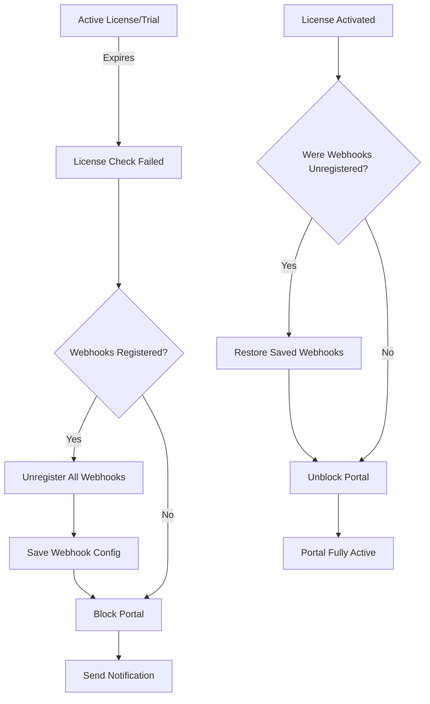

# License System Documentation

## Overview

```
Installation → 14-day trial → Trial expires → License required
                    ↓                              ↓
            Can use app freely            App blocked until licensed
```

## Database Schema

### Portal License Fields
```sql
-- app_portals table
is_trial TINYINT(1) DEFAULT 1           -- Currently in trial mode
trial_used TINYINT(1) DEFAULT 0         -- Trial has been used (permanent flag)
trial_end_date TIMESTAMP NULL            -- When trial expires
license_key VARCHAR(255) NULL           -- Activated license key
license_valid_until TIMESTAMP NULL      -- License expiration
license_activated_at TIMESTAMP NULL     -- When licensed
license_activated_by INT NULL           -- User who activated
is_blocked TINYINT(1) DEFAULT 0        -- Access blocked
block_reason VARCHAR(255) NULL          -- Why blocked
```

## Trial System

### Trial Activation
```php
// Automatically in InstallHandler.php
if (!$existingPortal) {
    $authData['is_trial'] = 1;
    $authData['trial_used'] = 0;
    $authData['trial_end_date'] = date('Y-m-d H:i:s', strtotime('+14 days'));
}
```

### Trial Rules
1. **One trial per member_id** - Cannot reuse after uninstall
2. **14 days default** - Configurable in config/app.php
3. **No feature limitations** - Full access during trial
4. **Auto-block after expiry** - Requires license to continue

### Trial Status Check
```php
$status = $db->checkLicenseStatus($domain);
/*
Returns:
[
    'status' => 'trial',
    'is_valid' => true/false,
    'expires_at' => '2025-02-14 12:00:00',
    'days_remaining' => 10
]
*/
```

## License Activation

### License Key Format
```
Format: XXXX-XXXX-XXXX-XXXX
Example: AB12-CD34-EF56-GH78
Pattern: /^[A-Z0-9]{4}-[A-Z0-9]{4}-[A-Z0-9]{4}-[A-Z0-9]{4}$/
```

### Activation Methods

#### 1. Via API Endpoint
```bash
POST /api/rest.php/license/activate
Content-Type: application/json

{
    "domain": "client.bitrix24.com",
    "license_key": "AB12-CD34-EF56-GH78",
    "valid_until": "2026-01-31 23:59:59"  # Optional
}
```

#### 2. Via PHP Code
```php
$db = Database::getInstance();
$activated = $db->activateLicense(
    $domain,
    $licenseKey,
    $validUntil,  // Optional, defaults to +1 year
    $userId       // Who activated
);
```

#### 3. Via Webhook Event
```php
// In LicenseHandler.php
$this->callBitrixMethod('event.bind', [
    'event' => 'ONLICENSE',
    'handler' => 'https://your-domain.com/api/webhook.php'
]);

// Send license activation
{
    "event": "LICENSE",
    "auth": {...},
    "data": {
        "operation": "activate",
        "license_key": "AB12-CD34-EF56-GH78"
    }
}
```

### Activation Process
```php
// backend/lib/Core/Database.php
public function activateLicense($domain, $licenseKey, $validUntil, $userId): bool
{
    // 1. Validate key format
    // 2. Set license fields
    // 3. Clear trial status (is_trial = 0)
    // 4. Remove blocks (is_blocked = 0)
    // 5. Log activation
}
```

## License Validation

### Server-Side Validation (Placeholder)
```php
// backend/handlers/events/LicenseHandler.php
private function verifyLicenseWithServer($licenseKey): array
{
    // TODO: Implement actual server check
    // Current: Accepts any valid format
    
    /* Production implementation:
    $response = curl_post('https://license-server.com/verify', [
        'license_key' => $licenseKey,
        'domain' => $this->domain,
        'member_id' => $this->portal['member_id']
    ]);
    
    return [
        'valid' => true,
        'valid_until' => '2026-01-31',
        'features' => ['all'],
        'max_users' => 0  // 0 = unlimited
    ];
    */
}
```

### Client-Side Check
```javascript
// Check license status from frontend
fetch('/api/rest.php/license/check?domain=' + APP_DATA.domain)
    .then(response => response.json())
    .then(data => {
        if (!data.license_status.is_valid) {
            showLicenseRequiredModal();
        }
    });
```

## License Enforcement

### Automatic Checking
```php
// BaseHandler::process() - Checks every request
$skipLicenseCheck = [
    'InstallHandler',
    'UninstallHandler', 
    'LicenseHandler'  // These bypass check
];

if (!in_array(static::class, $skipLicenseCheck)) {
    $licenseStatus = $this->checkLicense();
    if (!$licenseStatus['is_valid']) {
        Response::error('License expired or invalid', 402, $licenseStatus);
    }
}
```

### Manual Override
```php
// In any handler
class MyHandler extends BaseHandler
{
    public function handle(): array
    {
        // Skip auto-check, do manual
        $status = $this->db->checkLicenseStatus($this->domain);
        
        if ($status['status'] === 'trial') {
            // Allow but with limitations
            return $this->handleTrialMode();
        }
        
        if (!$status['is_valid']) {
            // Block completely
            return ['error' => true, 'message' => 'License required'];
        }
        
        // Full access
        return $this->handleLicensedMode();
    }
}
```

## Portal Lifecycle

### Installation States
```
NEW INSTALL
├── is_trial = 1
├── trial_used = 0
├── trial_end_date = NOW() + 14 days
└── is_blocked = 0

UNINSTALL (Trial Active)
├── is_active = 0
├── trial_used = 1  ← Marked as used
└── Record kept in database

REINSTALL (After Trial)
├── Check trial_used = 1
├── is_blocked = 1
├── block_reason = "Trial expired, license required"
└── Must activate license to unblock

LICENSE ACTIVATED
├── is_trial = 0
├── is_blocked = 0
├── license_key = "XXXX-XXXX-XXXX-XXXX"
└── license_valid_until = NOW() + 1 year
```

### Status Transitions
```
TRIAL → EXPIRED → BLOCKED → LICENSED → EXPIRED → BLOCKED
  ↓                           ↑
  └── Can activate anytime ───┘
```

## License Expiration Handling

### Check Expiration
```php
$status = $db->checkLicenseStatus($domain);

switch($status['status']) {
    case 'trial':
        if ($status['days_remaining'] <= 3) {
            // Show warning
            $this->sendNotification($userId, "Trial expires in {$status['days_remaining']} days");
        }
        break;
        
    case 'licensed':
        if ($status['days_remaining'] <= 30) {
            // Remind about renewal
            $this->sendNotification($userId, "License expires in {$status['days_remaining']} days");
        }
        break;
        
    case 'expired':
        // Block access
        $db->blockPortal($domain, 'License expired');
        break;
}
```

### Grace Period (Optional)
```php
// Allow 7 days after expiration
$graceDays = 7;
$expiredDate = strtotime($portal['license_valid_until']);
$graceEndDate = $expiredDate + ($graceDays * 86400);

if (time() <= $graceEndDate) {
    // Warning mode - allow access but show warnings
    $this->showExpirationWarning($daysLeft);
} else {
    // Hard block
    $this->blockAccess();
}
```

## License UI

### License Page (When Blocked)
```php
// public/index.php
function showLicenseRequiredPage($licenseStatus, $params): void
{
    // Shows when:
    // 1. Trial expired
    // 2. License expired
    // 3. Portal blocked
    
    // Display:
    // - Current status
    // - Days expired
    // - License activation form
    // - Purchase instructions
}
```

### Activation Form
```html
<div class="license-container">
    <h1>License Required</h1>
    <p>Your trial has expired. Please activate a license to continue.</p>
    
    <form id="licenseForm">
        <input type="text" 
               pattern="[A-Z0-9]{4}-[A-Z0-9]{4}-[A-Z0-9]{4}-[A-Z0-9]{4}"
               placeholder="XXXX-XXXX-XXXX-XXXX"
               required>
        <button type="submit">Activate License</button>
    </form>
    
    <div id="licenseStatus"></div>
</div>
```

### JavaScript Activation
```javascript
document.getElementById('licenseForm').onsubmit = async (e) => {
    e.preventDefault();
    
    const response = await fetch('/api/rest.php/license/activate', {
        method: 'POST',
        headers: {
            'Content-Type': 'application/json',
            'Authorization': 'Bearer ' + APP_DATA.app_sid
        },
        body: JSON.stringify({
            domain: APP_DATA.domain,
            license_key: e.target.license_key.value
        })
    });
    
    const result = await response.json();
    
    if (result.success) {
        window.location.reload();
    } else {
        showError(result.message);
    }
};
```

## License API Methods

### Check License Status
```php
GET /api/rest.php/license/check?domain=xxx.bitrix24.com

Response:
{
    "license_status": {
        "status": "licensed|trial|expired|blocked",
        "is_valid": true/false,
        "expires_at": "2026-01-31 23:59:59",
        "days_remaining": 365
    },
    "portal": {
        "is_trial": false,
        "trial_used": true,
        "has_license": true
    }
}
```

### Validate License Key
```php
POST /api/rest.php/license/validate
{
    "license_key": "XXXX-XXXX-XXXX-XXXX"
}

Response:
{
    "valid": true/false,
    "message": "License key format is valid",
    "valid_until": "2026-01-31"  // If valid
}
```

### Extend License
```php
POST /api/rest.php/license/extend
{
    "domain": "xxx.bitrix24.com",
    "extension_key": "EXT-XXXX-XXXX",
    "days": 365
}
```

## Monitoring & Reports

### License Statistics
```sql
-- Active licenses
SELECT COUNT(*) FROM app_portals 
WHERE license_key IS NOT NULL 
AND license_valid_until > NOW();

-- Expiring soon (30 days)
SELECT domain, license_valid_until,
       DATEDIFF(license_valid_until, NOW()) as days_left
FROM app_portals
WHERE license_valid_until BETWEEN NOW() AND DATE_ADD(NOW(), INTERVAL 30 DAY);

-- Trial usage
SELECT 
    COUNT(*) as total_portals,
    SUM(is_trial) as active_trials,
    SUM(trial_used AND license_key IS NULL) as expired_trials,
    SUM(license_key IS NOT NULL) as licensed
FROM app_portals;
```

### Automated Notifications
```php
// Cron job: daily_license_check.php
$portals = $db->query("
    SELECT * FROM app_portals 
    WHERE is_active = 1 
    AND (
        (is_trial = 1 AND DATEDIFF(trial_end_date, NOW()) IN (7,3,1))
        OR
        (license_key IS NOT NULL AND DATEDIFF(license_valid_until, NOW()) IN (30,7,1))
    )
");

foreach ($portals as $portal) {
    sendExpirationReminder($portal);
}
```

## Testing Licenses

### Simulate Trial Expiry
```sql
-- Set trial to expire tomorrow
UPDATE app_portals 
SET trial_end_date = DATE_ADD(NOW(), INTERVAL 1 DAY)
WHERE domain = 'test.bitrix24.com';

-- Expire immediately
UPDATE app_portals 
SET trial_end_date = DATE_SUB(NOW(), INTERVAL 1 DAY)
WHERE domain = 'test.bitrix24.com';
```

### Test License Activation
```bash
# Valid format test
curl -X POST https://your-domain.com/api/rest.php/license/validate \
  -H "Content-Type: application/json" \
  -d '{"license_key":"TEST-1234-5678-90AB"}'

# Activate test license
curl -X POST https://your-domain.com/api/rest.php/license/activate \
  -H "Content-Type: application/json" \
  -d '{
    "domain":"test.bitrix24.com",
    "license_key":"TEST-1234-5678-90AB",
    "valid_until":"2026-12-31 23:59:59"
  }'
```

### Webhook Lifecycle with License Status



### Reset Portal for Testing
```sql
-- Reset to trial state
UPDATE app_portals SET
    is_trial = 1,
    trial_used = 0,
    trial_end_date = DATE_ADD(NOW(), INTERVAL 14 DAY),
    license_key = NULL,
    license_valid_until = NULL,
    is_blocked = 0,
    block_reason = NULL
WHERE domain = 'test.bitrix24.com';
```